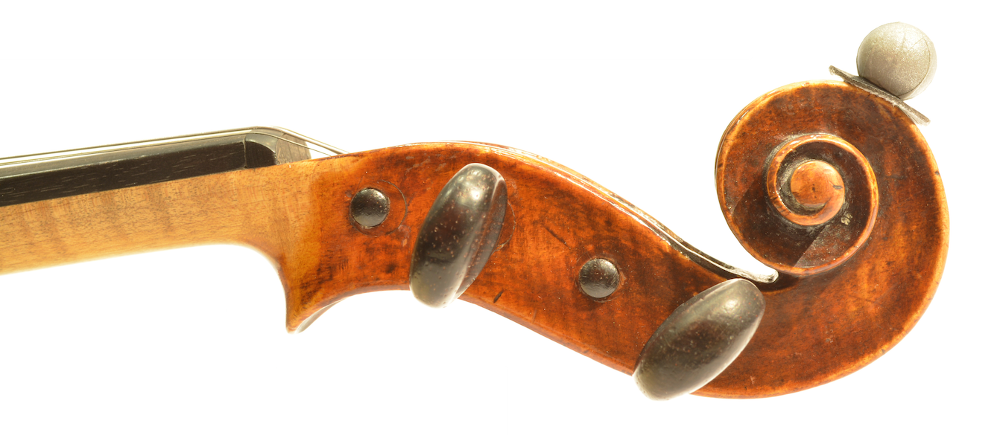

Welcome to my MUMT618 Final Project report! In this website you will find
information about my project on how the driving-point admittance, which
captures the effects of the instrument body, has on the playability of bowed
string instruments when played under static bowing conditions.

Playability is one of the essential characteristics, together with tone, that
confer to many instruments their identity. New numerical methods for
physically-based simulation of sound are allowing very detailed studies at how
instruments respond to slightly different inputs, which is what playability is
about. This project is a take at better understanding this concept in the
particular case of analyzing what happens then the driving-point admittance,
one of the most instrinsic characteristics of bowed string instruments,
changes.

The different sections are broken down into pages. Please use the left menu for
navigating, or start [here](intro).

