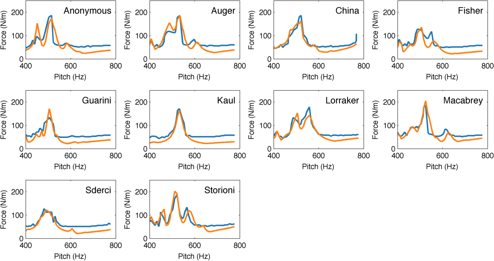
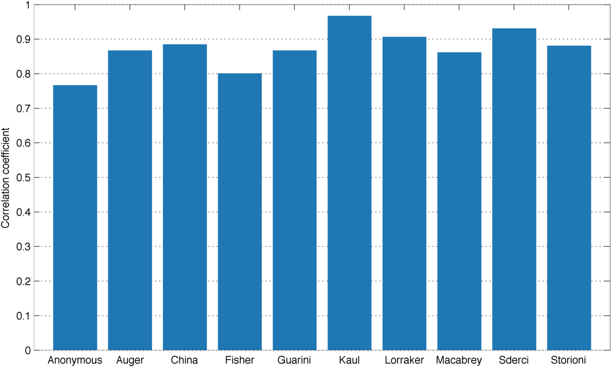
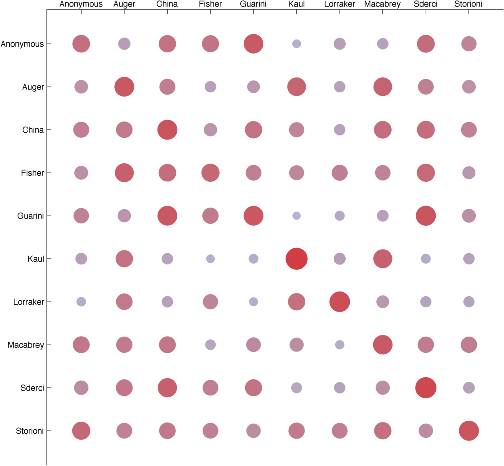

Here go the results.

*Simulated (blue) and theoretical (orange) minimum bow forces when playing a different pitch on different instruments.*

*Correlation between simulated and theoretical minimum bow forces.*

*Cross-correlations between simulated and theoretical minimum bow forces across different violins.*
